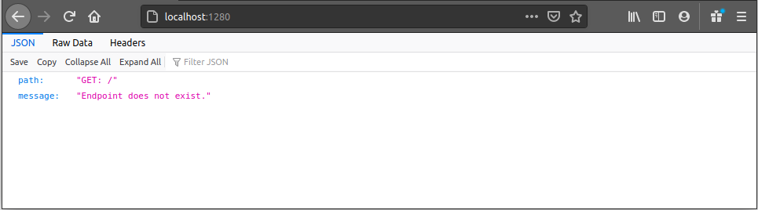
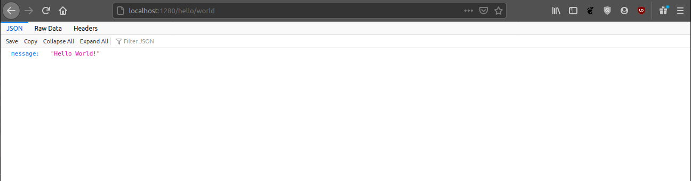
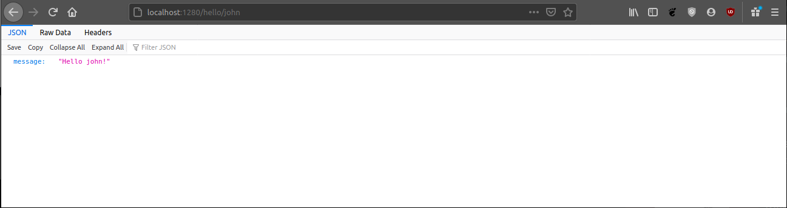
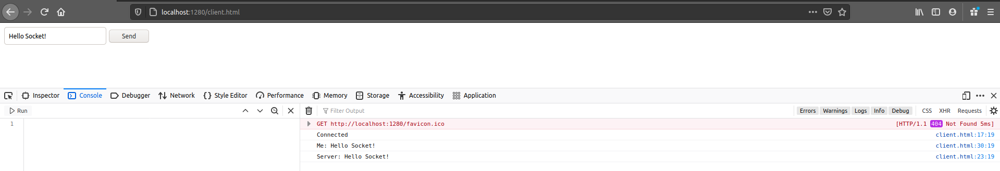
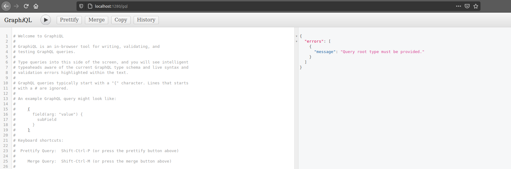

# Purple Cheetah


[](https://www.npmjs.com/package/@becomes/purple-cheetah)

Purple Cheetah is not a framework but rather a utility set
for [ExpressJS](https://expressjs.com/), written
in [Typescript](https://www.typescriptlang.org/). It was developed to resolve
issues in our company and give us tools with a small amount of external
dependencies for creating Web APIs (REST and/or GraphQL).

## Overview

- [Application](#application) - Is a main entry point for a Purple Cheetah
  application. By creating an object which extends `Purple Cheetah` abstraction
  and decorating it with `Application` decorator, Purple Cheetah object is
  created and its instance will contain `.listen` method which is used to start
  an express server. For more information see
  the [example](#application-example).
- [Networking](#network)
  - [Controllers](#network-controller) - Controller is an abstraction which
    allows you to split routes into logical units by decorating a class
    with `Controller` decorator. At the end, controller class will add its
    network methods to the express router. For more information see
    the [example](#network-controller-example).
  - [Middleware](#network-middleware) - Middleware is an abstraction that allows
    you to create a logical units by decorating a class with `Middleware`
    decorator. At the end, middleware class will be added to the express router.
    For more information see the [example](#network-middleware-example).
  - [Sockets](#network-socket) - In Purple Cheetah, socket is only a wrapper for
    the [socket.io](https://www.npmjs.com/package/socket.io) package and is
    enabled by using `EnableSocketServer` decorator on Purple Cheetah object.
    For more information see the [example](#network-socket-example).
- [Logging](#logging) - Purple Cheetah application uses simple but effective way
  of creating a logs. Logs are handled by a `Logger` class which prints messages
  to the console and saves the output to specified location. For more
  information see the [example](#logging-example)
- [Error handling](#error-handling)
- [Databases](#database)
  - [MongoDB](#database-mongodb) - Handler for MongoDB
    extends [mongoose](https://www.npmjs.com/package/mongoose) package and
    provides handlers for connecting to MongoDB database, creating models and
    repositories. To connect to a database use `EnableMongoDB` decorator on the
    application object, and to create a repository, use `MongoDBRepository`
    decorator on a repository object. For more details see
    the [example](#database-mongodb-example).
  - [File system](#database-fs) - FSDB is a custom module that provides
    MongoDB-like experience but uses a file system to store collections and
    entity data. For more information see the [example](#database-fs-example).
- [GraphQL](#graphql) - Uses custom solution which
  extends [express-graphql](https://www.npmjs.com/package/express-graphql)
  and [graphql](https://www.npmjs.com/package/graphql) packages but improves
  user experience and writing schemas by
  providing `QLEntry, QLResolver, QLObject, ...` decorators which are helping in
  organizing project and writing schemas much easier. For more information see
  the [example](#graphql-examle).
- [Security](#security)
  - [JWT](#security-jwt) - JWT security modules are provided by default but they
    are not hardwired into any part of Purple Cheetah. For more information see
    the [example](#security-jwt-example).
  - [HTTP Signature](#security-hs) - Is a fast and reliable security mechanism
    for service-to-service communication. No database or tokens are required but
    there are some drawbacks and limitations to current implementation. For more
    information see the [example](#security-hs-example).
- [Miracle](#miracle) - Is a custom solution for creating microservices with
  Purple Cheetah. At one point in the future, Miracle will become its own
  package to provide smaller package size for applications which need only this
  part or Purple Cheetah utility set. In short, Miracle provide tools for
  solving most common problems in microservice architecture which are:
  service-to-service communication, service policy, routing and error handling.
  - [Key Store](#miracle-ks) - Represent a Miracle service which is in charge of
    storing service keys and service policies. This means that it determines
    which service can communicate with which service and in which scope.
    Communication between services are not handled by it but when service
    authenticates with Miracle Key Store it will get security keys and policy by
    which it must obey. For more information see
    the [example](#miracle-ks-example).
  - [Registry](#miracle-r) - Is a Miracle service in charge of holding a record
    about where are services distributed, which status they have and how to
    connect to them. For more information see the [example](#miracle-r-example).
  - [Gateway](#miracle-g) - Is a Miracle service strongly coupled with Purple
    Cheetah application. In conjunction with Registry and Key Store it provides
    a routing and load balancing between services. For more information see
    an [example](#miracle-g-example).
  - [Connection](#miracle-c) - Is a handler for connection a service into the
    cluster. For more information see an [example](#miracle-c-example).

## Versioning

It is important to know how Purple Cheetah package versions work. All versions
are annotated as `x.y.z` where:

- `x` - indicates a major version of the package. This number between versions
  indicates that there are some braking changes in the package.
- `y` - indicates if a package is a stable production ready version, or a
  development version, and it can only be 0 or 1.
  - **1** - stable production ready (ex. `2.1.12`)
  - **0** - development (ex. `2.0.32`)
- `z` - indicates a minor version of the package. Changes to this parameter
  indicates only audits, performance improvements and some overall improvements
  that do not have effect on package usage.

## Get Started using CLI - NOT YET AVAILABLE

- Install Purple Cheetah CLI tool: `npm i -g @becomes/purple-cheetah-cli`
- Use CLI tool to create new project: `becomes-pcc --name hello-world`
- Navigate to project, run `npm run dev` and in the browser
  goto `localhost:1280`
- Done.

## Get started the hard way

- Create a typescript project and install Purple
  Cheetah: `npm i --save @becomes/purple-cheetah`,
- Install [nodemon](https://nodemon.io/): `npm i -D nodemon`,
- In the `src` directory create files called `main.ts` and `app.ts`,

```ts
// app.ts

import { PurpleCheetah, Application } from '@becomes/purple-cheetah';

@Application({
  port: process.env.PORT ? parseInt(
    process.env.PORT,
    10
  ) : 1280,
  controllers: [],
  middleware: [],
})
export class App extends PurpleCheetah {
}
```

```ts
// main.ts

import { App } from './app.ts';

let app: App;

async function initialize() {
  // Do some initialization before starting the App
}

initialize()
  .then(() => {
    app = new App();
    app.listen();
  })
  .catch((error) => {
    console.error(error);
    process.exit(1);
  });

export const Application = app;
```

```json
// package.json

{
  "scripts": {
    "dev": "nodemon src/main.ts"
    // ...
  },
  "nodemonConfig": {
    "watch": [
      "src"
    ],
    "ext": "ts"
  }
}
```

After this you are ready to start the application by running `npm run dev`.

## API Reference - NOT YET AVAILABLE

You can see full API Reference at #.

## Application

<div id="application"></div>

Application is a decorator used in conjunction with `Purple Cheetah` abstract
class to create a Purple Cheetah object which represents an application. Once a
class is annotated with `Application` decorator, a lot of things will happen.
First, main logger will be created with name `PurpleCheetah` and stored in the
class, express application will be created and simple queue list will be
initialized. After that the controller and middleware arrays will be
initialized, defaults will be pushed to them and `listen` function will be
created. Because of the initialization pipe, `Application` decorator should
always be first annotation of the application class. Once `listen` method is
called on an instance of the application class, first, waiting will occur until
the queue list is free and then express server will be starts.

Constructor of the `Purple Cheetah` abstract class is in charge of pushing
controller and middleware arrays to the express application. Pushing will occur
in specific order once a new instance of the class is created and after the
queue list is free.

- `start` method will be called (this is a method in which user can define some
  logic before initialization starts),
- middleware objects with property `after == false` will be added to the express
  application,
- `middle` method will be called (user defined logic),
- controller objects will be added to the express application,
- `finalize` method will be called (user defined logic),
- middleware objects with property `after == true` will be added to the express
  application,

### Example

<div id="application-example"></div>

First, project is created with a structure like shown bellow.

```txt
project
 └--- .eslintrc
 └--- .prettier
 └--- package.json
 └--- package-lock.json
 └--- tsconfig.json
 └--- src
       └--- main.ts
       └--- app.ts
```

This project structure is not required for the application to work, this is just
a recommendation. Customize files `.prettierrc`, `tsconfig.json` and `.eslintrc`
for your linking. File `package.json` will be copied from the starter project
and `npm i` command will be started. After this, inside the `app.ts`, Purple
Cheetah object will be created as shown below.

```ts
// ---> app.ts

import { Application, PurpleCheetah } from '@becomes/purple-cheetah';

@Application({
  port: process.env.PORT ? parseInt(
    process.env.PORT,
    10
  ) : 1280,
  controllers: [],
  middleware: [],
})
export class App extends PurpleCheetah {
}
```

This is a minimum required configuration to successfully start the application.
By taking a detailed look at `Application` decorator:

- `port` is a network port on which application will be available,
- `controllers` is an array of controller class instances (
  see [controller example](#network-controller-example) for more information),
- `middleware` is an array of middleware class instances (
  see [middleware example](#network-middleware-example) for more information).

In addition to this 3 required properties there are a few more (
like `httpRequestLoggerMiddleware`, ...), but they are self explained and can be
explored in detail by looking at a source code or by checking [API reference]().
For demonstration, user defined methods, of the Purple Cheetah class, will also
be populated.

```ts
// ---> app.ts

import { Application, PurpleCheetah } from '@becomes/purple-cheetah';

@Application({
  port: process.env.PORT ? parseInt(
    process.env.PORT,
    10
  ) : 1280,
  controllers: [],
  middleware: [],
})
export class App extends PurpleCheetah {
  protected start() {
    this.logger.info(
      'start',
      'This is the start.'
    );
  }

  protected middle() {
    this.logger.info(
      'middle',
      'This is the middle.'
    );
  }

  protected finalize() {
    this.logger.info(
      'finalize',
      'This is the finalize.'
    );
  }
}
```

This is how those 3 method are defined. Inside the `main.ts` application
initialization will be created. This can also be done inside the `app.ts` but it
is recommended to do it this way to keep the code clean.

```ts
// ---> main.ts

import { App } from './app';

let app: App;

async function initialize() {
  // Do some initialization before
  // starting the app.
  // ...
}

initialize()
  .then(() => {
    app = new App();
    app.listen();
  })
  .catch((error) => {
    console.error(error);
    process.exit(1);
  });

export const application = app;
```

Again this is just the recommendation, and if initializer is not required, it
does not have to be used. Simple example like `new App().listen()` will also
start the application but is not controllable like example above. With this done
application can be started by running `npm run dev`. After doing this, in a
console, messages should be seen (with colors):

```txt
[INFO] [2/10/2021, 6:19:08 PM] PurpleCheetah queue > "ApplicationInit" has been unregistered.
[INFO] [2/10/2021, 6:19:08 PM] PurpleCheetah  > Initialized.
[INFO] [2/10/2021, 6:19:08 PM] PurpleCheetah  > Starting server...

            Purple Cheetah - Started Successfully
            -------------------------------------             
            PORT: 1280
            PID: 29262
```

These messages shown in the console are generated by the `Logger` class. More
information about how to create your own log messages, can be found
in [Logger section](#logging).

By opening the browser and going to the `localhost:1280` response, shown in
Figure 1, can be seen.



_Figure 1 - Endpoint does not exist._

This message is sent, by default `not found` middleware. This middleware can be
overwritten by passing an instance of a middleware class to `notFoundMiddleware`
property in the `Application` decorator.

### Using pure Express with Purple Cheetah

As mentioned at the beginning, Purple Cheetah is nothing more than a set of
tools for the ExpressJS. Because of this, Purple Cheetah application exposes
express application via `PurpleCheetah.app` and it can be accessed from any of
the user defined methods. To see how to do this, see the example below.

```ts
// ---> app.ts

import { PurpleCheetah, Application } from '@becomes/purple-cheetah';

@Application({
  port: process.env.PORT ? parseInt(
    process.env.PORT,
    10,
  ) : 1280,
  controllers: [],
  middleware: [],
})
export class App extends PurpleCheetah {
  protected start() {
    this.app.get(
      '/express',
      (req, res) => {
        res.json({
          express: 'This is a message from the ExpressJS!',
        });
      },
    );
  }
}
```

If you start the development server and go to `localhost:1280/express` you will
be served a response from the get method registered in `start`.

## Networking

<div id="network"></div>

By being written and meant for the web, it is just natural to cover networking
tools in Purple Cheetah. For now, tools for creating REST, GraphQL and Socket
APIs are available. Since GraphQL tool set is big (in comparison to the REST
tool set) it will be covered in a [separate section](#graphql).

### Controller abstraction

<div id="network-controller"></div>

Most important tools for creating REST APIs are tools for connecting HTTP
requests to some logic, doing a required work and creating a response. This is
as basic as creating an HTTP route handler for specified method. In pure express
application this could be done something like this:

```ts
app.get(
  '/hello-world',
  (request, response) => {
    response.json({
      message: 'Hello World!',
    });
  }
);
```

This is all very nice but writing a code this way can be messy and organizing it
can be a challenge. Because of this, abstracts like Controller, Controller
method and Middleware exist in Purple Cheetah tool set. In this section,
Controller abstract will be covered.

Controller abstraction in Purple Cheetah is nothing more than abstraction which
allows better code readability. There are 2 important parts to
know, `Controller` decorator and `ControllerPrototype` interface, which are used
in conjunction on a controller class. Decorator is used to annotate the class
and inject metadata, while the interface is used to tell type checker, that
specified class have properties of a controller.

#### Example

<div id="network-controller-example"></div>

Project structure from [Application example](#application-example) will be
extended to contain `hello-world` directory with `index.ts` and `controller.ts`
files inside it (it is important to know that controller file does not need to
have a `controller` name, this can be any name).

```txt
project
 └--- src
       └--- main.ts
       └--- app.ts
       └--- hello-world
             └--- index.ts
             └--- controller.ts
```

Index pattern will be used to expose children files, therefore inside
the `index.ts`, controller file will be exported.

```ts
// ---> hello-world/index.ts

export * from './controller';
```

Inside the `controller.ts` controller class `HelloWorldController` will be
created, which implements controller interface and is annotated by the
controller decorator. This controller will have only one get method at
path `/hello/world`, which will return a JSON response with property `message`
and constant value of `Hello World!`.

```ts
// ---> hello-world/controller.ts

import {
  ControllerPrototype,
  Logger,
  Controller,
  Get,
} from '@becomes/purple-cheetah';
import { Router } from 'express';

@Controller('/hello')
export class HelloWorldController implements ControllerPrototype {
  baseUri: string;
  initRouter: () => void;
  logger: Logger;
  name: string;
  router: Router;

  @Get('/world')
  sayHelloWorld(): {
    message: string;
  } {
    return {
      message: 'Hello World!',
    };
  }
}
```

All variables in the class are populated by the decorator and if decorator is
not used, those variables must be populated by a hand or error will occur in
next step. With controller class created, only thing left to do is to add it to
the controller array in the application decorator.

```ts
// ---> app.ts

import { PurpleCheetah, Application } from '@becomes/purple-cheetah';
import { HelloWorldController } from './hello-world';

@Application({
  port: process.env.PORT ? parseInt(
    process.env.PORT,
    10
  ) : 1280,
  controllers: [new HelloWorldController()],
  // <---
  // Instance of the controller
  // has been added to the
  // controller array.
  middleware: [],
})
export class App extends PurpleCheetah {
}
```

By starting the application and going to the `localhost:1280/hello/world`,
response from the controller can be seen, as shown in Figure 2.



_Figure 2 - Hello world response from a controller method._

URIs are following the same rules as in the Express, because at the end, this is
an Express application. Because of this, by adding a new get method with the
path parameter `name`, dynamic response can be created.

```ts
// ---> hello-world/controller.ts

// ...

@Controller('/hello')
export class HelloWorldController implements ControllerPrototype {
  // ...

  @Get('/:name')
  greetUser(
    request: Request,
  ): { message: string; } {
    return {
      message: `Hello ${request.params.name}!`,
    };
  }
}
```

After application is restarted, by going to, for
example `localhost:1280/hello/john`
, **Hello john!** message will be sent as a response, as shown in Figure 3.



_Figure 3 - Controller method which greets a user._

### Middleware abstraction

<div id="network-middleware"></div>

Middleware is similar to a controller, but it is usually used to transform
incoming or outgoing data in some shape or form. Because of this, middleware is
triggered for all methods on all routes which are starting with a specified
route.

Like a controller, middleware is a class which implements
a `MiddlewarePrototype` interface and which is annotated by a `Middleware`
decorator. Interface is used to tell type checker that specified class is a
middleware while decorator is used to inject metadata into it.

#### Example

<div id="network-middleware-example"></div>

To explain a middleware, example
from [controller section](#network-controller-example) will be extended. For
routes `/hello/:name` middleware will be created which will convert `name`
parameter to have first letter in upper case and all other letters in lower
case. This will be done by creating a directory `hello-world/middleware`, and
inside it files called `index.ts` and `pretty-name.ts`.

```ts
// ---> hello-world/index.ts

export * from './middleware';
```

```ts
// ---> hello-world/middleware/index.ts

export * from './pretty-name';
```

```ts
// ---> hello-world/middleware/pretty-name.ts

import {
  Logger,
  Middleware,
  MiddlewarePrototype,
} from '@becomes/purple-cheetah';
import {
  ErrorRequestHandler,
  NextFunction,
  Request,
  RequestHandler,
  Response,
} from 'express';

@Middleware({
  uri: '/hello/:name',
  handler: async (request: Request, response: Response, next: NextFunction) => {
    request.headers.pretty_name =
      request.params.name.substring(
        0,
        1
      ).toUpperCase() +
      request.params.name.substring(1).toLowerCase();
    next();
  },
})
export class HelloWorldPrettyNameMiddleware implements MiddlewarePrototype {
  after: boolean;
  logger: Logger;
  uri: string;
  handler: RequestHandler | RequestHandler[] | ErrorRequestHandler;
}
```

As it can be seen, path parameter is transformed and value is placed in the
header with name `pretty_name`. After this, `next` function is called to
indicate that next handler in a chain should be executed. Now the controller
method will be modified to use this new header property.

```ts
// ---> hello-world/controller.ts

// ...

@Controller('/hello')
export class HelloWorldController implements ControllerPrototype {

  // ...

  @Get('/:name')
  async greetPerson(request: Request): Promise<{ message: string }> {
    return {
      message: HelloWorldRequestHandler.greetPerson(
        request.headers.pretty_name as string,
        // <---
        // Using header prop.
      ),
    };
  }
}
```

Only thing left is to add the middleware to the application middleware array.

```ts
// ---> app.ts

import { Application, PurpleCheetah } from '@becomes/purple-cheetah';
import {
  HelloWorldController,
  HelloWorldPrettyNameMiddleware,
} from './hello-world';

@Application({
  port: parseInt(
    process.env.PORT,
    10
  ),
  controllers: [new HelloWorldController()],
  middleware: [
    new HelloWorldPrettyNameMiddleware(), // <--- Middleware
  ],
})
export class App extends PurpleCheetah {
}
```

With the server started, by going to the `localhost:1280/hello/john`, **Hello
John!** message can be seen.

### Socket

<div id="network-socket"></div>

Socket is a very powerful tool because it provides a realtime communication
channel between client application and a server. In Purple Cheetah, socket tools
are provided via [socket.io](https://socket.io/) package and socket server is
just a wrapper for the socket.io.

#### Example

<div id="network-socket-example"></div>

To explain how sockets are implements in Purple Cheetah, example
from [application section](#application-example) will be extended. On top of the
application decorator, `EnableSocketServer` decorator will be added with minimum
configuration.

```ts
// ---> app.ts

import {
  Application,
  EnableSocketServer,
  PurpleCheetah,
} from '@becomes/purple-cheetah';

@EnableSocketServer({
  path: '/socket/server',
  onConnection: (socket) => {
    return {
      id: socket.id,
      socket,
      group: 'general',
      createdAt: Date.now(),
    };
  },
})
@Application({
  port: process.env.PORT ? parseInt(
    process.env.PORT,
    10
  ) : 1280,
  controllers: [],
  middleware: [],
})
export class App extends PurpleCheetah {
}
```

At this point server can push events to a client but client cannot push events
to the server since no event handlers are provided. Because of this, 1 simple
handler will be created at path `socket/echo.ts` and it will look like this:

```ts
// ---> socket/echo.ts

import {
  SocketConnectionService,
  SocketEventHandler,
} from '@becomes/purple-cheetah';

export class SocketEchoHandler implements SocketEventHandler {
  name = 'echo';

  async handler(data: { message: string }) {
    SocketConnectionService.emitToGroup(
      'general',
      this.name,
      {
        message: data.message,
      }
    );
  }
}
```

As it can be seen, handler will get event data and emit it back. Then this
handler will be added to the socket server in `app.ts` file.

```ts
@EnableSocketServer({
  path: '/socket/server',
  onConnection: (socket) => {
    return {
      id: socket.id,
      socket,
      group: 'general',
      createdAt: Date.now(),
    };
  },
  eventHandlers: [new SocketEchoHandler()], // <-- Here
})
```

All that is left to do is to create a client, and the socket can be tested.

```html

<html lang='en'>
<head>
  <meta charset='UTF-8' />
  <meta name='viewport' content='width=device-width, initial-scale=1.0' />
  <title>Socket Echo</title>
  <!-- Socket.io client library -->
  <script src='http://localhost:1280/socket/server/socket.io.js'></script>
</head>
<body>
<input id='input' value='Hello Socket!' />
<button id='send'>Send</button>
<script>
  window.onload = () => {
    // Connect to the server.
    const socket = io('http://localhost:1280', {
      path: '/socket/server',
    });
    socket.on('connect', () => {
      console.log('Connected');
    });
    socket.on('disconnect', () => {
      console.log('Disconnected');
    });
    socket.on('echo', (data) => {
      console.log('Server:', data.message);
    });
    let message = 'Hello Socket!';
    document.getElementById('input').addEventListener('keyup', (event) => {
      message = event.target.value;
    });
    document.getElementById('send').addEventListener('click', () => {
      console.log(`Me: ${message}`);
      socket.emit('echo', { message });
    });
  };
</script>
</body>
</html>
```

Example from above will produce a result shown in Figure 4.



_Figure 4 - Socket server and client example result._

## Logging

<div id="logging"></div>

Logging is a very important aspect for every backend web API because if
something goes wrong, developers need to find a reason. Without logs this is
close to impossible. Purple Cheetah provides a simple logger object which can be
used for this purpose. Logging a message is done by calling a method inside a
`Logger` class. This class provides 3 public methods:

- **info** - Information level message (white color),
- **warn** - Warning level message (yellow color),
- **error** - Error level message (red color).

Each log message can be split into 5 parts:

```txt
[INFO] [11/18/2020, 10:08:51 AM] PurpleCheetah .listen > Server started on port 1280.
  ^     ^                         ^             ^         ^
  |     |                         |             |         Message data.
  |     |                         |             |
  |     |                         |             Source of the message. This is usually a
  |     |                         |             method or a function in which logger
  |     |                         |             object method was called.
  |     |                         |
  |     |                         Instance of a logger object. Place where logger object
  |     |                         was created. This is usually a name of a class or
  |     |                         a function which wraps some logic.
  |     |
  |     Time and data of message origin. This is generated using time and data from the
  |     system on which application is running.
  |
  Message level.
```

If output for the logger is not specified when creating an instance of
application object, logs will be placed in `logs/*` directory of current working
directory. Log files will be grouped by date, therefore names will be formatted
like `<year>-<month>-<day>.log` (for example `2020-10-21.log`). Have in mind
that logger uses ANSI colors, and they are also pushed to a log file so in order
to view logs without ANSI characters
use [less](https://linux.die.net/man/1/less) or install ANSI viewer, other vise
logs will look weird.

### Example

<div id="logging-example"></div>

Using Logger class is pretty simple. One approach, in a custom class could be:

```ts
import { Logger } from '@becomes/purple-cheetah';

export class MyClass {
  private static readonly logger = new Logger('MyClass');

  method() {
    // ...
    MyClass.logger.info(
      'method',
      'This is info message.'
    );
  }
}
```

or in a function:

```ts
import { Logger } from '@becomes/purple-cheetah';

export function MyFunction() {
  const logger = new Logger('MyFunction');
  this.logger.info(
    '',
    'This is info message.'
  );
}
```

Have in mind that some Purple Cheetah decorators will inject logger by default.
One example is the Controller decorator. By taking a look
at [Controller Example](#network-controller-example), it can be seen that
HelloWorldController class have `logger` property. This is an instance of the
Logger class created by the `@Controller` decorator, therefore it can be used
for logging messages inside the class.

## Error Handling

<div id="error-handling"></div>

Handling errors is very important since unhandled errors can lead to an
application crash or even a host system crash. Also, unhandled errors can create
vulnerabilities in application since running a code after unhandled error might
lead to unpredictable behaviors. In short, errors are bad in all application
types and large part of developing a backend application is spent on handling
errors. Because of this, Purple Cheetah comes with simple http error handler
which wraps all http methods created using `@Controller` decorator.

Basic idea is that errors can be split into 2 groups:

- Unhandled error - is an error which occurred somewhere in the code outside the
  try-catch block. Main characteristic is that developers do not know that this
  error can occur, therefore its name.
- Handled error - is an error that can occur in an application but there is a
  logic in place for handling it if it occurs.

For handling errors in a Purple Cheetah application, `HttpErrorFactory` can be
used to create an `HttpError` object. If this error object is thrown from a
controller method, Purple Cheetah will know how to handle it. This will be
explained using an example.

### Example

<div id="error-handling-example"></div>

Express provides basic error handler for a http method which will prevent
application from crashing. This can be seen by writing a simple code:

```ts
import * as express from 'express';

const app = express();
app.get(
  '/crash',
  () => {
    throw Error('This is unhandled error.');
  }
);
app.listen(
  1280,
  () => console.log('Listening on port 1280')
);
```

If this endpoint is called, response will have status 500 and error stack trace
as a body. This is great, because application did not crash and output is very
useful since reason and where error occurred is provided. A bad thing is that
this information is not provided only to developers but also to the end user,
and this can be a bad idea. This type of error can be called unhandled error
because it is not thrown with an intent (event though it is handled by the
Express). For this example to make more sense, Express example will be modified
to return a user from a predefined user array.

```ts
const users = [
  {
    name: 'Test 1',
  },
  {
    name: 'Test 2',
  },
];
app.get(
  '/user/:index',
  (request, response) => {
    const id = parseInt(
      request.params.index,
      10
    );
    const user = users[id];
    response.json({
      id,
      name: user.name,
    });
  }
);
```

This endpoint will run ok for routes `/user/0` and `/user/1` but for any other
value it will break at `user.name`. This can be handled in many ways and one can
be:

```ts
app.get(
  '/user/:index',
  (request, response) => {
    const id = parseInt(
      request.params.index,
      10
    );
    if (isNaN(id) || id < 0) {
      response.status(400).json({
        message: `Invalid index "${id}" was provided. Index must be >= 0.`,
      });
      return;
    }
    const user = users[id];
    if (!user) {
      response.status(404).json({
        message: `User with index "${id}" does not exist.`,
      });
      return;
    }
    response.json({
      id,
      name: user.name,
    });
  }
);
```

This code is good and easy to understand plus API consumer have some meaningful
information if something goes wrong. If error logging is required for this
error (usually it is), things can get complex and messy. Purple Cheetah error
handling is built on top of this logic and same example would look something
like this.

```ts
import {
  Controller,
  ControllerPrototype,
  Get,
  HttpErrorFactory,
  HttpStatus,
  Logger,
} from '@becomes/purple-cheetah';
import { Request, Router } from 'express';

@Controller('/user')
export class UserController implements ControllerPrototype {
  baseUri: string;
  initRouter: () => void;
  logger: Logger;
  name: string;
  router: Router;

  private static users = [
    {
      name: 'Test 1',
    },
    {
      name: 'Test 2',
    },
  ];

  @Get('/:index')
  async getUserByIndex(
    request: Request,
  ): Promise<{
    id: number;
    name: string;
  }> {
    // Create an error object.
    const error = HttpErrorFactory.instance(
      'getUserByIndex',
      this.logger
    );
    const id = parseInt(
      request.params.index,
      10
    );
    if (isNaN(id) || id < 0) {
      throw error.occurred(
        HttpStatus.BAD_REQUEST,
        {
          message: `Invalid index "${id}" was provided. Index must be >= 0.`,
        }
      );
    }
    const user = UserController.users[id];
    if (!user) {
      throw error.occurred(
        HttpStatus.NOT_FOUNT,
        {
          message: `User with index "${id}" does not exist.`,
        }
      );
    }
    return {
      id,
      name: user.name,
    };
  }
}
```

If only number of lines are taken into a count, Purple Cheetah example looks
much worse than Express example but this is actually not true since errors are
logged and endpoint structure is much easier to understand. In addition to this,
stack trace of unhandled errors in this method will not be returned to the API
user, but will only be logged.

## Database

<div id="database"></div>

Out of the box, Purple Cheetah supports interfacing with MongoDB and FS
databases. MongoDB interface is built on top
of [mongoose](https://www.npmjs.com/package/mongoose) package, which is a very
nice package by itself. Reason for creating database module in Purple Cheetah is
to provide a unified interface for all databases supported. In the future idea
is to provide support for PostgreSQL, MySQL and CouchDB, while the interface for
using all these databases will be the same.

### MongoDB

<div id="database-mongodb"></div>

As already said, a MongoDB interface in Purple Cheetah is built on top of
the [mongoose package](https://www.npmjs.com/package/mongoose). Interface is
split into 3 parts:

- `@EnableMongoDB` - decorator used on the Application class which connects to
  MongoDB database and monitors a connection.
- `@MongoDBRepository` - decorator used on a repository class which
  implements `MongoDBRepositoryPrototype` interface. Interface is used to
  describe class as a MongoDB repository while the decorator is used to inject
  metadata and provide common methods (methods available in every MongoDB
  repository class).
- `IEntity` and `Entity` - Interfaces for describing MongoDB document.

The Best way to explain how this works is by using an example.

#### Example

<div id="database-mongodb-example"></div>

Example from [Application](#application-example) section will be extended and
simple Todo API will be created. First, MongoDB will be enabled by decorating
the application class with `EnableMongoDB`.

```ts
// ---> app.ts

import * as express from 'express';
import {
  Application,
  EnableMongoDB,
  PurpleCheetah,
} from '@becomes/purple-cheetah';

@EnableMongoDB({
  selfHosted: {
    db: {
      host: process.env.DB_HOST || 'localhost',
      name: process.env.DB_NAME || 'test',
      port: process.env.DB_PORT ? parseInt(
        process.env.DB_PORT,
        10
      ) : 27017,
    },
    user: {
      name: process.env.DB_USER || 'test',
      password: process.env.DB_PASS || 'test1234',
    },
  },
})
@Application({
  port: process.env.PORT ? parseInt(
    process.env.PORT,
    10
  ) : 1280,
  controllers: [],
  middleware: [new BodyParserMiddleware()],
})
export class App extends PurpleCheetah {
  protected start() {
    this.app.use(express.static('public'));
  }
}
```

Next step is to create a model of Todo entity/document.

```ts
// ---> todo/models/todo.ts

import { Entity, IEntity } from '@becomes/purple-cheetah';
import { Schema, Types } from 'mongoose';

export interface ITodo extends IEntity {
  task: string;
}

export class Todo implements Entity {
  constructor(
    public _id: Types.ObjectId,
    public createdAt: number,
    public updatedAt: number,
    public task: string,
  ) {
  }

  static get schema(): Schema {
    return new Schema({
      _id: Types.ObjectId,
      createdAt: Number,
      updatedAt: Number,
      task: String,
    });
  }
}
```

Have in mind that in Todo class, properties `_id`, `createdAt` and `updatedAt`
are required, and their types are predefined. Static method `schema` is optional
at this position.

With model created, next step is to create a repository.

```ts
// ---> todo/repositories/todo.ts

import {
  Logger,
  MongoDBRepository,
  MongoDBRepositoryPrototype,
} from '@becomes/purple-cheetah';
import { Model } from 'mongoose';
import { ITodo, Todo } from '../models';

@MongoDBRepository({
  entity: {
    schema: Todo.schema,
  },
  name: 'todos',
})
export class TodoRepository implements MongoDBRepositoryPrototype<Todo, ITodo> {
  repo: Model<ITodo>;
  logger: Logger;
  findAll: () => Promise<Todo[]>;
  findAllById: (ids: string[]) => Promise<Todo[]>;
  findAllBy: <Q>(query: Q) => Promise<Todo[]>;
  findById: (id: string) => Promise<Todo>;
  findBy: <Q>(query: Q) => Promise<Todo>;
  add: (e: Todo) => Promise<boolean>;
  update: (e: Todo) => Promise<boolean>;
  deleteById: (id: string) => Promise<boolean>;
  deleteAllById: (ids: string[]) => Promise<number | boolean>;
  count: () => Promise<number>;
}
```

With this done everything related with MongoDB is set up and controller can be
created, which will implement an application logic.

```ts
// ---> todo/controller.ts

import {
  Controller,
  ControllerPrototype,
  Delete,
  Get,
  HttpErrorFactory,
  HttpStatus,
  Logger,
  MountMongoDBRepository,
  ObjectUtility,
  Post,
  StringUtility,
} from '@becomes/purple-cheetah';
import { Request, Router } from 'express';
import { Types } from 'mongoose';
import { Todo } from './models';
import { TodoRepository } from './repositories';

@Controller('/todo')
export class TodoController implements ControllerPrototype {
  baseUri: string;
  initRouter: () => void;
  logger: Logger;
  name: string;
  router: Router;

  @MountMongoDBRepository(TodoRepository)
  private todoRepo: TodoRepository;

  @Get('/all')
  async getAll(): Promise<{ todos: Todo[] }> {
    return { todos: await this.todoRepo.findAll() };
  }

  @Get('/:id')
  async getById(request: Request): Promise<{ todo: Todo }> {
    const error = HttpErrorFactory.instance(
      'getById',
      this.logger
    );
    if (!request.params.id) {
      throw error.occurred(
        HttpStatus.BAD_REQUEST,
        'Missing parameter "id".'
      );
    }
    if (!StringUtility.isIdValid(request.params.id)) {
      throw error.occurred(
        HttpStatus.BAD_REQUEST,
        `Invalid ID "${request.params.id}" was provided.`,
      );
    }
    const todo = await this.todoRepo.findById(request.params.id);
    if (!todo) {
      throw error.occurred(
        HttpStatus.NOT_FOUNT,
        `Todo with ID "${request.params.id}" does not exist.`,
      );
    }
    return { todo };
  }

  @Post()
  async create(request: Request): Promise<{ todo: Todo }> {
    const error = HttpErrorFactory.instance(
      'create',
      this.logger
    );
    try {
      ObjectUtility.compareWithSchema(
        request.body,
        {
          task: {
            __type: 'string',
            __required: true,
          },
        },
        'body',
      );
    } catch (e) {
      throw error.occurred(
        HttpStatus.BAD_REQUEST,
        e.message
      );
    }
    const todo = new Todo(
      new Types.ObjectId(),
      Date.now(),
      Date.now(),
      request.body.task,
    );
    const addResult = await this.todoRepo.add(todo);
    if (addResult === false) {
      throw error.occurred(
        HttpStatus.INTERNAL_SERVER_ERROR,
        'Failed to add Todo to the database.',
      );
    }
    return { todo };
  }

  @Delete('/:id')
  async deleteById(request: Request): Promise<{ message: 'Success.' }> {
    const error = HttpErrorFactory.instance(
      'deleteById',
      this.logger
    );
    if (!request.params.id) {
      throw error.occurred(
        HttpStatus.BAD_REQUEST,
        'Missing parameter "id".'
      );
    }
    if (StringUtility.isIdValid(request.params.id) === false) {
      throw error.occurred(
        HttpStatus.BAD_REQUEST,
        `Invalid ID "${request.params.id}" was provided.`,
      );
    }
    const todo = await this.todoRepo.findById(request.params.id);
    if (!todo) {
      throw error.occurred(
        HttpStatus.NOT_FOUNT,
        `Todo with ID "${request.params.id}" does not exist.`,
      );
    }
    const deleteResult = await this.todoRepo.deleteById(request.params.id);
    if (deleteResult === false) {
      throw error.occurred(
        HttpStatus.INTERNAL_SERVER_ERROR,
        'Failed to delete Todo from the database.',
      );
    }
    return { message: 'Success.' };
  }
}
```

Only thing left is to add this controller to the application controller array.
Have in mind, to run this application successfully you will need to set up and
configure MongoDB database.

As you can see, pipe is simple and easy to use.
In [FSDB example](#database-fs-example) you will see that same approach is used
and that database is used the same way as a MongoDB.

### File system database

For short FSDB, is a module developed in the scope of this project. It is a
simple database which uses file system to store documents. This module is not
developed to be used in a production environment. Idea for it is to be used in
development and testing to make integration much faster and easier. The simplest
way to describe how this module works is to show an example.

<div id="database-fs"></div>

#### Example

<div id="database-fs-example"></div>

Simple application will be created which uses FSDB as a database. Same
application which was created in [MongoDB example](#database-mongodb-example)
will be used, but instead of MongoDB, FSDB will be used. First step is to create
a Todo model.

```ts
// ---> app.ts

import * as express from 'express';
import {
  Application,
  BodyParserMiddleware,
  PurpleCheetah,
} from '@becomes/purple-cheetah';
import { TodoController } from './todo';

@Application({
  port: process.env.PORT ? parseInt(
    process.env.PORT,
    10
  ) : 1280,
  controllers: [new TodoController()],
  middleware: [new BodyParserMiddleware()],
})
export class App extends PurpleCheetah {
  protected start() {
    this.app.use(express.static('public'));
  }
}
```

```ts
// ---> todo/models/todo.ts

import { FSDBEntity, ObjectSchema } from '@becomes/purple-cheetah';

export class Todo implements FSDBEntity {
  constructor(
    public _id: string,
    public createdAt: number,
    public updatedAt: number,
    public task: string,
  ) {
  }

  static get schema(): ObjectSchema {
    return {
      _id: {
        __type: 'string',
        __required: true,
      },
      createdAt: {
        __type: 'number',
        __required: true,
      },
      updatedAt: {
        __type: 'number',
        __required: true,
      },
      task: {
        __type: 'string',
        __required: true,
      },
    };
  }
}
```

With model created, next step is to create a repository.

```ts
// ---> todo/repositories/todo.ts

import {
  FSDBRepositoryPrototype,
  Model,
  Logger,
  FSDBRepository,
} from '@becomes/purple-cheetah';
import { Todo } from '../models';

@FSDBRepository({
  schema: Todo.schema,
  collectionName: 'todos',
})
export class TodoRepository implements FSDBRepositoryPrototype<Todo> {
  repo: Model<Todo>;
  logger: Logger;
  findAll: () => Promise<Todo[]>;
  findAllBy: (query: (e: Todo) => boolean) => Promise<Todo[]>;
  findAllById: (ids: string[]) => Promise<Todo[]>;
  findBy: (query: (e: Todo) => boolean) => Promise<Todo>;
  findById: (id: string) => Promise<Todo>;
  add: (e: Todo) => Promise<void>;
  addMany: (e: Todo[]) => Promise<void>;
  update: (e: Todo) => Promise<boolean>;
  deleteById: (id: string) => Promise<boolean>;
  deleteAllById: (ids: string[]) => Promise<number | boolean>;
  deleteOne: (query: (e: Todo) => boolean) => Promise<void>;
  deleteMany: (query: (e: Todo) => boolean) => Promise<void>;
  count: () => Promise<number>;
}

export const TodoRepo = new TodoRepository();
```

With the repository created, controller logic can be implemented and added to
the application controller array.

```ts
// ---> todo/repositories/todo.ts

import { randomBytes } from 'crypto';
import {
  Controller,
  ControllerPrototype,
  Delete,
  Get,
  HttpErrorFactory,
  HttpStatus,
  Logger,
  ObjectUtility,
  Post,
} from '@becomes/purple-cheetah';
import { Request, Router } from 'express';
import { Todo } from './models';
import { TodoRepo } from './repositories';

@Controller('/todo')
export class TodoController implements ControllerPrototype {
  baseUri: string;
  initRouter: () => void;
  logger: Logger;
  name: string;
  router: Router;

  @Get('/all')
  async getAll(): Promise<{ todos: Todo[] }> {
    return { todos: await TodoRepo.findAll() };
  }

  @Get('/:id')
  async getById(request: Request): Promise<{ todo: Todo }> {
    const error = HttpErrorFactory.instance(
      'getById',
      this.logger
    );
    if (!request.params.id) {
      throw error.occurred(
        HttpStatus.BAD_REQUEST,
        'Missing parameter "id".'
      );
    }
    const todo = await TodoRepo.findById(request.params.id);
    if (!todo) {
      throw error.occurred(
        HttpStatus.NOT_FOUNT,
        `Todo with ID "${request.params.id}" does not exist.`,
      );
    }
    return { todo };
  }

  @Post()
  async create(request: Request): Promise<{ todo: Todo }> {
    const error = HttpErrorFactory.instance(
      'create',
      this.logger
    );
    try {
      ObjectUtility.compareWithSchema(
        request.body,
        {
          task: {
            __type: 'string',
            __required: true,
          },
        },
        'body',
      );
    } catch (e) {
      throw error.occurred(
        HttpStatus.BAD_REQUEST,
        e.message
      );
    }
    const todo = new Todo(
      randomBytes(24).toString('hex'),
      Date.now(),
      Date.now(),
      request.body.task,
    );
    try {
      await TodoRepo.add(todo);
    } catch (e) {
      throw error.occurred(
        HttpStatus.INTERNAL_SERVER_ERROR,
        'Failed to add Todo to the database.',
      );
    }
    return { todo };
  }

  @Delete('/:id')
  async deleteById(request: Request): Promise<{ message: 'Success.' }> {
    const error = HttpErrorFactory.instance(
      'deleteById',
      this.logger
    );
    if (!request.params.id) {
      throw error.occurred(
        HttpStatus.BAD_REQUEST,
        'Missing parameter "id".'
      );
    }
    const todo = await TodoRepo.findById(request.params.id);
    if (!todo) {
      throw error.occurred(
        HttpStatus.NOT_FOUNT,
        `Todo with ID "${request.params.id}" does not exist.`,
      );
    }
    const deleteResult = await TodoRepo.deleteById(request.params.id);
    if (deleteResult === false) {
      throw error.occurred(
        HttpStatus.INTERNAL_SERVER_ERROR,
        'Failed to delete Todo from the database.',
      );
    }
    return { message: 'Success.' };
  }
}
```

## GraphQL

<div id="graphql"></div>

GraphQL is a great solution with which powerful and easy to use API can be
created. Purple Cheetah supports GraphQL out of the box, and it is built on top
of [graphql](https://www.npmjs.com/package/graphql)
and [express-graphql](https://www.npmjs.com/package/express-graphql) packages.

It can be said that REST APIs are composed of 2 main parts: controller and
middleware. Because of this, they are "easy" to implement but hard to consume,
while GraphQL is harder to implement but easy to consume. Complexity in
development comes from need to create schemas and resolvers, which is not a bad
thing. Purple Cheetah implementation is pretty easy to understand and best way
to explain this is by using an example.

### Example

<div id="graphql-example"></div>

In this example simple Todo list GraphQL API will be created, the same one
showed in [FBDB example](#database-fs-example), therefore FSDB will be used
as a database while controller methods will be replaced with a GraphQL
resolvers. First thing to do is to decorate the application
with `@EnableGraphQL` decorator.

```ts
// ---> app.ts

import * as express from 'express';
import {
  Application,
  EnableGraphQL,
  PurpleCheetah,
} from '@becomes/purple-cheetah';

@EnableGraphQL({
  rootName: 'MyApp',
  uri: '/gql',
  graphiql: true,
})
@Application({
  port: process.env.PORT ? parseInt(
    process.env.PORT,
    10
  ) : 1280,
  controllers: [],
  middleware: [],
})
export class App extends PurpleCheetah {
  protected start() {
    this.app.use(express.static('public'));
  }
}
```

This is a minimum configuration required to start an application with GraphQL
API enabled. At this point GrephQL will be available
at *http://localhost:1280/gql*. If `uri` property is not provided, GraphQL API
will be available at the root of the domain (in this
case *http://localhost:1280*). By starting a development server and going to the
url in a browser, Graph*i*QL can be seen, as shown in Figure 5.



_Figure 5 - GraphiQL._

Next step is to create a Todo Object.

```ts
// ---> todo/gql/objects/todo.ts

import {
  QLFieldPrototype,
  QLObject,
  QLObjectPrototype,
} from '@becomes/purple-cheetah';

@QLObject({
  name: 'Todo',
  fields: [
    {
      name: '_id',
      type: 'String!',
    },
    {
      name: 'createdAt',
      type: 'Float!',
    },
    {
      name: 'updatedAt',
      type: 'Float!',
    },
    {
      name: 'task',
      type: 'String!',
    },
  ],
})
export class TodoQLObject implements QLObjectPrototype {
  name: string;
  type?: string;
  fields: QLFieldPrototype[];
  description?: string;
  wrapperObject?: QLObjectPrototype;
}
```

## Security

<div id="security"></div>

### JWT

<div id="security-jwt"></div>

#### Example

<div id="security-jwt-example"></div>

### HTTP signature

<div id="security-hs"></div>

#### Example

<div id="security-hs-example"></div>

## Miracle

<div id="miracle"></div>

### Key Store

<div id="miracle-ks"></div>

#### Example

<div id="miracle-ks-example"></div>

### Registry

<div id="miracle-r"></div>

#### Example

<div id="miracle-r-example"></div>

### Gateway

<div id="miracle-g"></div>

#### Example

<div id="miracle-g-example"></div>

### Connection

<div id="miracle-c"></div>

#### Example

<div id="miracle-c-example"></div>

